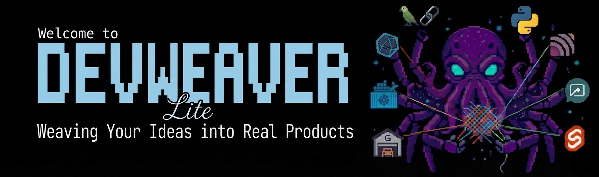

<p align="center">
  <picture>
    <source media="(prefers-color-scheme: dark)" srcset="assets/devweaver_lite_logo.png">
    
  </picture>
</p>

<p align="center">
  <strong>A provider-agnostic AI skill for building production-grade applications with zero infrastructure required.</strong>
</p>

<p align="center">
  <a href="https://github.com/ircbarros/devweaver-lite/actions/workflows/ci.yml?branch=main">
    
  </a>
  &nbsp;
  <a href="https://github.com/ircbarros/devweaver-lite/releases">
    
  </a>
  &nbsp;
  <a href="LICENSE">
    
  </a>
  &nbsp;
  <a href="https://github.com/ircbarros/devweaver-lite/actions/workflows/scorecard.yml">
    
  </a>
</p>

<p align="center">
  <a href="https://github.com/ircbarros/devweaver-lite/issues?q=is%3Aissue+is%3Aopen+label%3A%22good+first+issue%22">
    
  </a>
  &nbsp;
  <a href="https://github.com/ircbarros/devweaver-lite/issues?q=is%3Aissue+is%3Aopen+label%3ATODO">
    
  </a>
  &nbsp;
  <a href="https://github.com/ircbarros/devweaver-lite/pulls">
    
  </a>
  &nbsp;
  <a href="https://www.buymeacoffee.com/ircbarros">
    
  </a>
</p>

---
> **Status**: `0.1.0-beta.1`
> This skill is being actively developed. Feedback and contributions are welcome!

DevWeaver-Lite is a zero-infrastructure version of the DevWeaver AI application builder skill.

It delivers the same 10-phase workflow and behavioral guardrails as full DevWeaver but requires no Docker, no databases, and no self-hosted services.

Copy one file, configure two HTTP endpoints, and your AI assistant becomes a production-grade engineering partner.

---

## Prerequisites

- Node.js >= 18 (only required if using Playwright or Filesystem MCP -- optional)
- No other prerequisites for basic use

---

## Quick Start

**Step 1**:

Pick your provider from the table below and copy its activation file to the correct location.

**Step 2 (For IDE providers only)**:

Copy the MCP config template to your project.

**Step 3**:

Tell the agent your project path if using a chat or web provider.
**(For IDE providers the workspace path should be detected automatically)**

---

## Provider Setup

| Provider | Activation file | MCP config | Project path |
|---|---|---|---|
| GitHub Copilot | Copy `provider-specific/copilot/.github/copilot-instructions.md` to `.github/` | Merge `provider-specific/copilot/.vscode/mcp.json` into `.vscode/` | `${workspaceFolder}` implicit |
| Cursor | Copy `provider-specific/cursor/.cursorrules` to project root | Merge `provider-specific/cursor/.cursor/mcp.json` into `.cursor/` | Workspace implicit |
| Windsurf | Copy `provider-specific/windsurf/.windsurfrules` to project root | Merge `provider-specific/windsurf/.windsurf/mcp.json` into `.windsurf/` | Workspace implicit |
| Claude (claude.ai) | Upload `provider-specific/claude/CLAUDE.md` as Project Instructions; upload `SKILL.md` + `librarian/CATALOG.md` as Knowledge | None needed | Tell agent in chat |
| Claude Desktop | Upload `provider-specific/claude/CLAUDE.md`; see `claude_desktop_config.json.example` | See `claude_desktop_config.json.example` | Tell agent in chat |
| Gemini (AI Studio) | Paste `provider-specific/gemini/gemini_context.md` as System Instructions | None | Tell agent in chat |
| OpenAI (ChatGPT) | Paste `provider-specific/openai/openai_context.md` as Custom Instructions | None | Tell agent in chat |
| OpenRouter | Paste `provider-specific/openrouter/openrouter_context.md` as system message | None | Tell agent in chat |
| Kimi (Moonshot) | Paste `provider-specific/kimi/kimi_context.md` as system message | None | Tell agent in chat |
| Mistral (Le Chat) | Paste `provider-specific/mistral/mistral_context.md` as system message | None | Tell agent in chat |
| OpenClaw | Paste `provider-specific/openclaw/openclaw_context.md` as system message | None | Tell agent in chat |
| Any other | See `provider-specific/generic/README.md` | See `provider-specific/generic/README.md` | Tell agent in chat |

---

## Framework Integration

For LangChain, AutoGen, CrewAI, Agno, Dify, or any OpenAI-compatible API,
inject the contents of `SYSTEM_PROMPT.md` as the system message.

| Framework | Injection method |
|---|---|
| LangChain | `SystemMessage(content=open("SYSTEM_PROMPT.md").read())` |
| AutoGen | `AssistantAgent(system_message=open("SYSTEM_PROMPT.md").read())` |
| CrewAI | `Agent(backstory=open("SYSTEM_PROMPT.md").read())` |
| Dify / Flowise | Paste into the System Prompt field |
| OpenAI API | `messages=[{"role":"system","content": ...}]` |
| Agno | `Agent(instructions=open("SYSTEM_PROMPT.md").read())` |

---

## MCP Servers

| MCP | Copilot | Cursor / Windsurf | Claude Desktop | Web providers |
|---|---|---|---|---|
| GitHub | HTTP (native Copilot, no token) | stdio binary + `GITHUB_TOKEN` | stdio binary + `GITHUB_TOKEN` | N/A |
| Context7 | HTTP (no install) | HTTP (no install) | `npx -y mcp-remote` | N/A |
| Playwright | `npx -y` (optional) | `npx -y` (optional) | `npx -y` (optional) | N/A |
| Filesystem | `npx -y` (optional, L3 refs) | `npx -y` (optional, L3 refs) | `npx -y` (optional) | N/A |

Detailed MCP config templates are in each provider package.
For VS Code Copilot, GitHub and Context7 are HTTP -- zero install.
`npx -y` packages auto-download on first use -- no prior npm install needed.

---

## Providing the Project Path

For IDE providers (Copilot, Cursor, Windsurf): the agent uses the workspace path automatically.

For chat and API providers (Claude, Gemini, OpenAI, OpenRouter, Kimi, Mistral, OpenClaw):
tell the agent at the start of each session:

```text
Work on the project at /path/to/my-project
```

The agent will ask if it cannot determine the path.

---

## Compared to Full DevWeaver

| Feature | DevWeaver-Lite | Full DevWeaver |
|---|---|---|
| Setup time | 5 minutes | 30-60 minutes |
| Infrastructure | None required | Docker + 6 services |
| Knowledge retrieval | Markdown CATALOG (keyword) | Qdrant hybrid search (semantic) |
| Observability | None (stdout) | LangFuse traces |
| Session memory | Memory MCP (optional) | mem0ai (persistent) |
| Workflow | 10-phase behavioral | 10-phase LangGraph |
| Human gates | Provider tool approval | LangGraph interrupt_before |
| Standards/references | Identical (14 + 35 files) | Identical (14 + 35 files) |
| OWASP compliance | Full | Full |

---

## Troubleshooting

- **Skill does not activate**: confirm you copied the correct activation file and placed it correctly (see Provider Setup table).
- **MCP connection fails**: confirm `GITHUB_TOKEN` is set for Cursor, Windsurf, or Claude Desktop. VS Code Copilot does not require a token.
- **Context budget warning**: reduce L3 file loading to max 3 per phase (R-PD-03).
- **CONFIRM gate not firing**: review the provider-specific activation file -- ensure the full skill definition is present.

For edge-case documentation see `references/teaching/guide_qa_simulation.md`.

---

## Contributing

Contributions are welcome! Please read [CONTRIBUTING.md](CONTRIBUTING.md) for guidelines.

- Browse [good first issues](https://github.com/ircbarros/devweaver-lite/issues?q=is%3Aissue+is%3Aopen+label%3A%22good+first+issue%22) to get started
- Report bugs using the [Bug Report template](https://github.com/ircbarros/devweaver-lite/issues/new?template=bug_report.yml)
- Request features using the [Feature Request template](https://github.com/ircbarros/devweaver-lite/issues/new?template=feature_request.yml)

---

## Security

See [SECURITY.md](SECURITY.md) for the security policy and responsible disclosure process.
Do not open public issues for security vulnerabilities.

---

## License

[MIT](LICENSE) - Copyright (c) 2026 Italo Barros

---

## Support the Project

If DevWeaver-Lite saves you time, consider buying me a coffee:

<a href="https://www.buymeacoffee.com/ircbarros">
  
</a>
