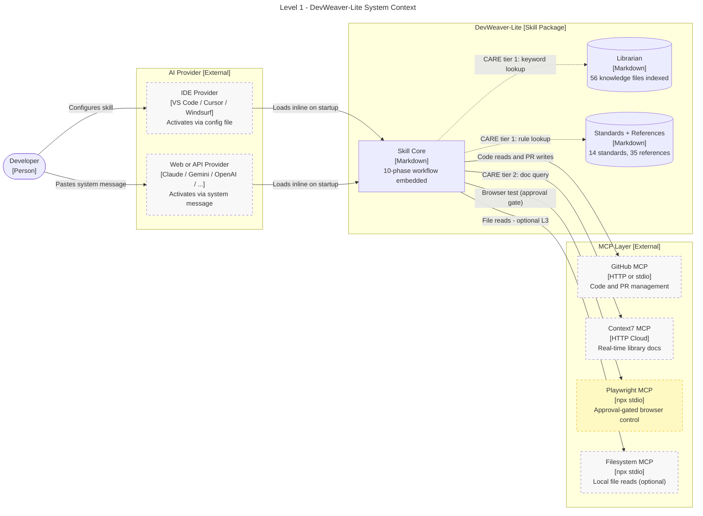

# ADR-Lite-001: DevWeaver-Lite Architecture

**Status**: Accepted
**Date**: 2026-05-06
**Authors**: Italo Barros

---

## Context

The full DevWeaver agent requires 6 self-hosted services (PostgreSQL, Qdrant, Redis, n8n,LangFuse, mem0) plus 9 MCP servers to operate. This infrastructure barrier prevents adoption in environments where:

- Developers lack Docker or server resources
- Quick prototyping is needed without a full deployment
- Teams want to evaluate the skill before committing to infrastructure
- The target project itself is lightweight and does not need vector search or observability

DevWeaver-Lite addresses this barrier by replacing all infrastructure dependencies with a zero-infrastructure equivalent that preserves all behavioral invariants.

---

## Decisions

### Decision 1: Zero Infrastructure

Replace the 6-service stack with no services:

| Full DevWeaver | DevWeaver-Lite |
|---|---|
| PostgreSQL 16.x (Librarian Star Schema + checkpointing) | No database knowledge in Markdown files |
| Qdrant 1.9.x (9 domain collections, hybrid search) | Markdown Librarian (CATALOG.md + domain indexes) |
| Redis 7.x (rate limiting, session cache) | No cache, stateless per session |
| n8n 1.x (5 Librarian sync pipelines) | Manual update or scripts/sync_catalog.py |
| LangFuse 2.x (LLM trace observability) | No observability, logging to stdout only |
| mem0ai (cross-session memory) | Memory MCP (optional, npx-based) |

**Rationale**: Every heavy service had a lightweight equivalent. The behavioral outcomes (correct retrieval, session continuity, task tracking) are preserved with lower fidelity but no infrastructure cost.

### Decision 2: 5 MCPs

Retain 5 MCP servers, all npx-installable or cloud-hosted:

| MCP | Transport | Auth | Purpose |
|---|---|---|---|
| GitHub MCP | stdio binary | GITHUB_TOKEN | Code management, PR/issues, remote file read/write |
| Context7 MCP | HTTP (cloud) | CONTEXT7_API_KEY | Real-time library documentation |
| Playwright MCP | npx stdio | none | Browser automation + E2E testing |
| Filesystem MCP | npx stdio | none | Local file read/write |
| Memory MCP | npx stdio | none (optional) | Cross-session preference storage |

### Decision 3: Markdown Librarian

Replace Qdrant hybrid search + PostgreSQL Star Schema with a flat Markdown index:

- `librarian/CATALOG.md`: master table of all 56 knowledge files (ISBN, domain, tier, topics, path, summary)
- `librarian/index/{domain}.md`: 9 per-domain filtered views of CATALOG.md
- `librarian/rule_librarian_query.md`: CARE-Lite retrieval protocol

### Decision 4: CARE-Lite

Same 4-tier protocol as full DevWeaver but tier 1 uses the Markdown Librarian:

1. CATALOG scan + Filesystem MCP reads (librarian/CATALOG.md) - confidence >= 0.9 to stop
2. Context7 MCP (library docs) - confidence >= 0.8 to stop
3. Web search (official docs, blogs, forums) - confidence >= 0.7 to stop
4. Model knowledge (fallback only - flag confidence tier explicitly)

### Decision 5: Behavioral Workflow

The 10-phase sequence (PRE-TASK through POST-TASK) is expressed entirely as instructions
in SKILL.md and provider activation files, not as a deployed LangGraph state machine.

```
PRE-TASK --> REQUIREMENTS --> FETCH_RULES --> RESEARCH --> ARCHITECTURE
    --> [CONFIRM gate] --> IMPLEMENT --> VALIDATE --> [GIT GATE] --> POST-TASK
```

Human gates (CONFIRM and GIT GATE) are implemented via provider-native tool approval mechanisms (VS Code chat confirm, Claude tool use approval, etc.).

### Decision 6: Provider Agnostic

Universal injection via SYSTEM_PROMPT.md: a single flat file containing the complete skill definition that can be pasted as a system message to any provider.

Provider-specific packages exist for 11 providers: claude, copilot, cursor, windsurf, gemini, openai, openrouter, kimi, mistral, openclaw, generic.

Each package contains:
- `SKILL.md` with YAML frontmatter (name, provider, context_budget)
- Activation file (CLAUDE.md, copilot-instructions.md, .cursorrules, etc.)
- `mcp_config.json` with provider-specific context_budget

### Decision 7: Full Invariant Preservation

The following invariants from full DevWeaver are fully preserved in Lite:

| Invariant | Full DevWeaver | DevWeaver-Lite |
|---|---|---|
| CONFIRM gate | LangGraph interrupt_before confirm_node | Provider tool approval / explicit pause |
| GIT GATE | LangGraph interrupt_before git_gate_node | Provider tool approval / explicit pause |
| 14 standards files | standards/ directory | standards/ directory (unchanged) |
| 35 reference files | references/ directory | references/ directory (unchanged) |
| 6 template files | templates/ directory | templates/ directory (unchanged) |
| 10 NEVER rules | SKILL.md section 2 | SKILL.md section 2 (adapted) |
| 4-tier instruction hierarchy | SKILL.md section 3 | SKILL.md section 3 (unchanged) |
| OWASP LLM Top 10 | rule_owasp_llm_top10.md | rule_owasp_llm_top10.md (unchanged) |
| POST-TASK 6-step sweep | post_task_node | POST-TASK phase instructions |

### Decision 8: Self-Contained Activation Files (Zero Install)

All provider activation files (copilot-instructions.md, .cursorrules, .windsurfrules, CLAUDE.md, gemini_context.md, openai_context.md, etc.) embed the full skill definition inline. No external file reads are required for core skill operation.

**Decision**:
- Embed SKILL.md content inline in every activation file.
- The Filesystem MCP is optional, and should be used only for L3 reference reads (standards/, references/, templates/, librarian/) when the user has devweaver-lite installed locally and wants deeper references.

**Trade-offs**:
- PRO: Truly zero install. Paste one file and the full skill is active.
- PRO: Works on all 11 supported providers without modification.
- PRO: No environment variables, no npm, no install scripts required.
- CON: Activation files are larger (~300 lines vs ~40 lines previously).
- CON: Updating the skill requires updating all 10+ activation files.
  Mitigation: SKILL.md remains the canonical source; activation files are generated from it.

**Alternatives rejected**:
- Centralized install with DEVWEAVER_LITE_PATH env var: requires shell configuration per machine, breaks portability, not zero install.
- Per-project subdirectory with path prefix: still requires filesystem paths to work, confusing for users who move or rename the devweaver-lite directory.

---

## Diagrams

> Required: C4 Level 1 System Context and workflow state machine (inline below).
> L2 and sequence diagrams are split per `rule_diagram_standards_c4.md` §3 (>3 boundary subgraphs).

### Diagram Index

| File | Type | Scope |
|---|---|---|
| This file (§ below) | C4 Level 1 | System context - developer, skill, providers, MCPs |
| This file (§ below) | stateDiagram-v2 | 10-phase workflow state transitions |
| `dw_lite_l2a_core_containers.md` | C4 Level 2a | Skill core, activation files, librarian, knowledge store |
| `dw_lite_l2b_provider_mcp.md` | C4 Level 2b | Provider packages and MCP integration layer |
| `dw_lite_seq_workflow.md` | sequenceDiagram | End-to-end 10-phase workflow execution |
| `dw_lite_seq_care_lite.md` | sequenceDiagram | CARE-Lite 4-tier retrieval protocol |

---

### C4 Level 1 - System Context



---

### Workflow State Machine

```mermaid
stateDiagram-v2
  direction LR
  [*] --> PRE_TASK

  state PRE_TASK   : Phase 1 - scope, constraints, and project_root confirmed
  state REQUIREMENTS : Phase 2 - functional and non-functional requirements extracted
  state FETCH_RULES  : Phase 3 - CATALOG scan and MCP docs fetched (CARE tiers 1 and 2)
  state RESEARCH     : Phase 4 - codebase read, findings synthesized into context
  state ARCHITECTURE : Phase 5 - C4 diagrams and phased implementation plan produced
  state CONFIRM      : Human gate - approval required before implementation starts
  state IMPLEMENT    : Phase 6 - test-first code generation, file by file
  state VALIDATE     : Phase 7 - tests, lint, type-check, security scan
  state GIT_GATE     : Human gate - approval required before commit and push
  state POST_TASK    : Phase 8 - 6-step sweep: docs, README, ADR, CATALOG, templates, CHANGELOG

  PRE_TASK     --> REQUIREMENTS : scope confirmed
  REQUIREMENTS --> FETCH_RULES  : requirements approved
  FETCH_RULES  --> RESEARCH     : rules and docs loaded
  RESEARCH     --> ARCHITECTURE : synthesis complete
  ARCHITECTURE --> CONFIRM      : proposal ready
  CONFIRM      --> REQUIREMENTS : feedback - revise requirements
  CONFIRM      --> ARCHITECTURE : feedback - revise architecture
  CONFIRM      --> IMPLEMENT    : approved
  IMPLEMENT    --> VALIDATE     : code written
  VALIDATE     --> IMPLEMENT    : checks failing - fix and retry
  VALIDATE     --> GIT_GATE     : all checks pass
  GIT_GATE     --> IMPLEMENT    : amendments requested
  GIT_GATE     --> POST_TASK    : approved and committed
  POST_TASK    --> [*]
```



---

## Relationship to Full DevWeaver ADRs

| Full DevWeaver ADR | Relationship |
|---|---|
| ADR-001 (Librarian: Star Schema, Qdrant, n8n) | Superseded for Lite - replaced by Decision 3 (Markdown Librarian) |
| ADR-002 (Provider agnosticism, 10-phase workflow) | Inherited - workflow and agnosticism preserved in full |
| ADR-003 (LangGraph SkillState, 23 conventions) | Partially superseded - SkillState removed, 23 conventions preserved as instructions |
| ADR-004 (Deployment management) | Not applicable - no deployment in Lite |

---

## Acceptance Criteria

- [x] All 10 workflow phases documented in SKILL.md and SYSTEM_PROMPT.md
- [x] Both human gates (CONFIRM, GIT GATE) present in all 11 provider packages
- [x] CATALOG.md indexes all 56 knowledge files
- [x] 5 MCPs configured with correct transport and env var pattern
- [x] All 10 NEVER rules preserved verbatim or adapted
- [x] No emojis, no em dashes in any file (R-DS-10)
- [x] C4 Level 1 System Context diagram (inline, flowchart LR)
- [x] Workflow state machine diagram (inline, stateDiagram-v2 direction LR)
- [x] C4 Level 2a Core Containers diagram (dw_lite_l2a_core_containers.md)
- [x] C4 Level 2b Provider and MCP diagram (dw_lite_l2b_provider_mcp.md)
- [x] Sequence: 10-phase workflow (dw_lite_seq_workflow.md)
- [x] Sequence: CARE-Lite retrieval protocol (dw_lite_seq_care_lite.md)

> **Line count note**: This file is 254 lines, exceeding R-PD-02 (200 lines).
> Justified exception: `rule_diagram_standards.md` mandates that every ADR MUST contain
> a C4 Level 2 Container diagram and at least one UML Sequence diagram inline.
> The C4 L1 and state machine diagrams are embedded here; L2 and full sequences are split
> per the split-threshold rule (>3 boundary subgraphs) into companion files in this directory.
