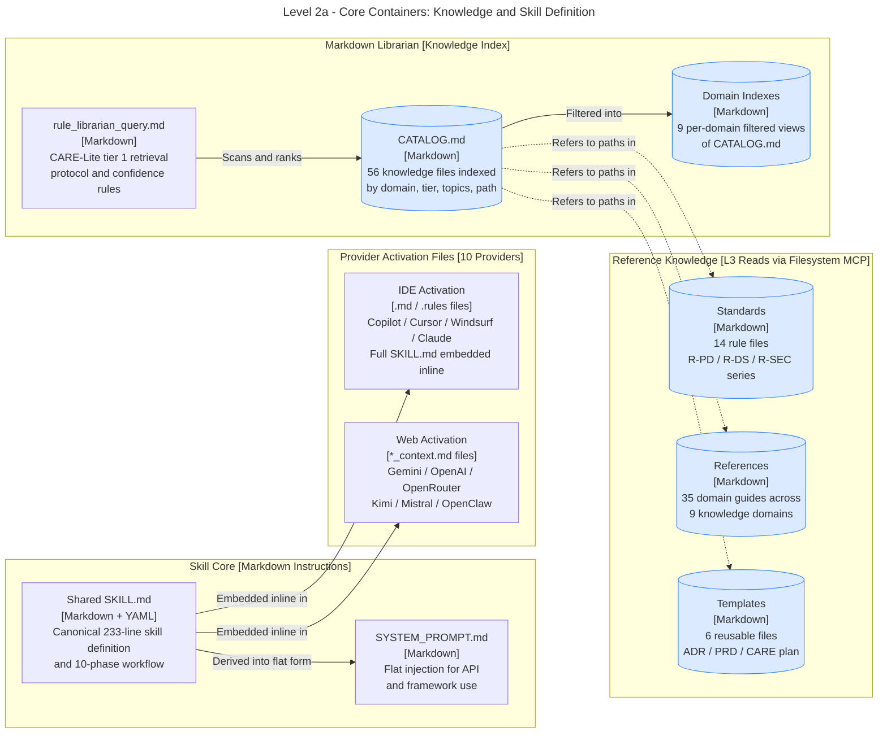

# Level 2a - Core Containers: Knowledge and Skill Definition

> Part of ADR-Lite-001. See also: `dw_lite_l2b_provider_mcp.md` (provider and MCP integration).
> **Rule applied**: L2 split per `rule_diagram_standards_c4.md` §3 (>3 boundary subgraphs).

---

## Scope

This diagram shows the internal containers of the DevWeaver-Lite skill package that are
responsible for knowledge storage, skill definition, and workflow instructions.

---

## Diagram

---

## Notes

- `shared_skill` is the single source of truth; activation files are generated from it.
- Dotted edges (`-.->`) indicate that CATALOG.md stores paths only; actual file content
  is read on demand by the Filesystem MCP during CARE tier 1 execution.
- `system_prompt` is equivalent to `ide_act` / `web_act` but targets API and framework callers.
