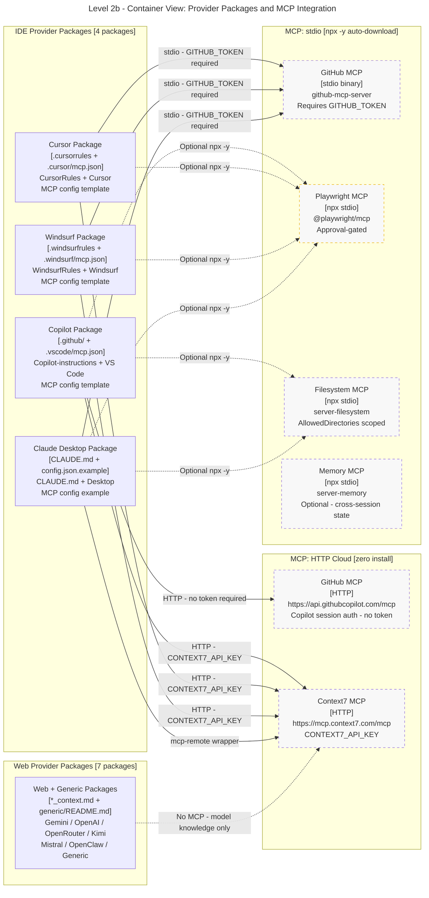

# Level 2b - Container View: Provider Packages and MCP Integration

> Part of ADR-Lite-001. See also: `dw_lite_l2a_core_containers.md` (core knowledge containers).
> **Rule applied**: L2 split per `rule_diagram_standards_c4.md` §3 (>3 boundary subgraphs).

---

## Scope

This diagram shows how each provider package connects to MCP servers. It distinguishes
HTTP cloud endpoints (zero install) from stdio npx transports (auto-download on first use)
and highlights the Playwright MCP as approval-gated.

---

## Diagram

---

## Notes

- Dotted edges (`-.->`) from web_pkgs to context7 indicate no MCP connection is possible
  for web/chat providers; context7 is shown only to illustrate the capability gap.
- The `playwright` node is styled with the approval class to signal that every call
  requires explicit human confirmation (interrupt_before: true in mcp_config.json).
- `memory` is not shown with any provider edge because it requires explicit user opt-in;
  it is not configured by default in any MCP template.
