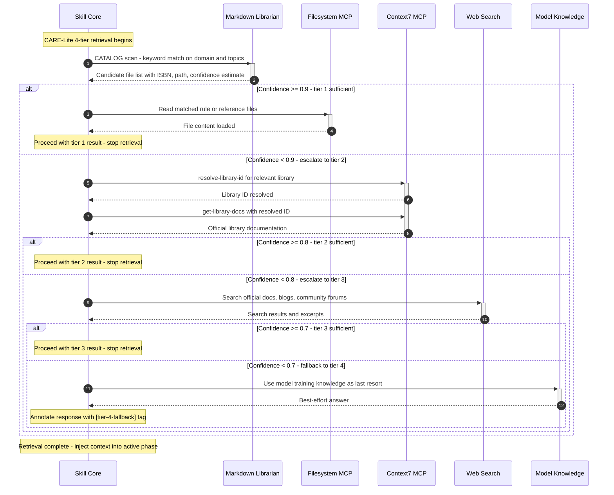

# Sequence: CARE-Lite Retrieval Protocol

> Part of ADR-Lite-001. Shows the 4-tier knowledge retrieval chain used in Phase 3 (FETCH_RULES)
> and Phase 4 (RESEARCH) of every workflow execution.
> See also: `dw_lite_seq_workflow.md` (full workflow context).

---

## Diagram

---

## Confidence Thresholds

| Tier | Source | Stop threshold | Fallback action |
|---|---|---|---|
| 1 | Markdown Librarian + Filesystem MCP | >= 0.9 | Escalate to tier 2 |
| 2 | Context7 MCP (official docs) | >= 0.8 | Escalate to tier 3 |
| 3 | Web search (docs, blogs, forums) | >= 0.7 | Escalate to tier 4 |
| 4 | Model training knowledge | Always | Tag `[tier-4-fallback]` |
