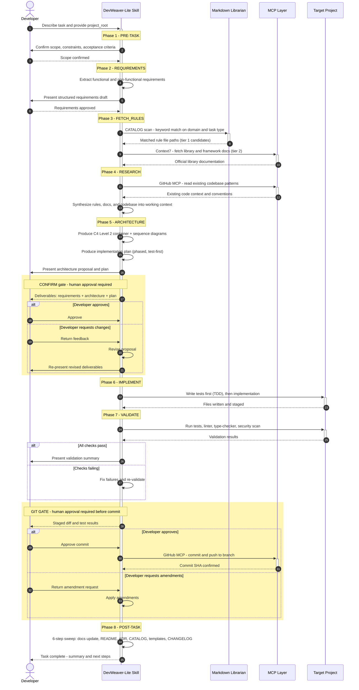

# Sequence: 10-Phase Workflow Execution

> Part of ADR-Lite-001. Shows the end-to-end request lifecycle from task intake to completion.
> See also: `dw_lite_seq_care_lite.md` (CARE-Lite retrieval detail).

---

## Diagram

