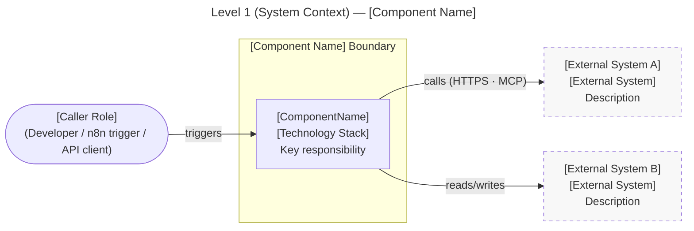
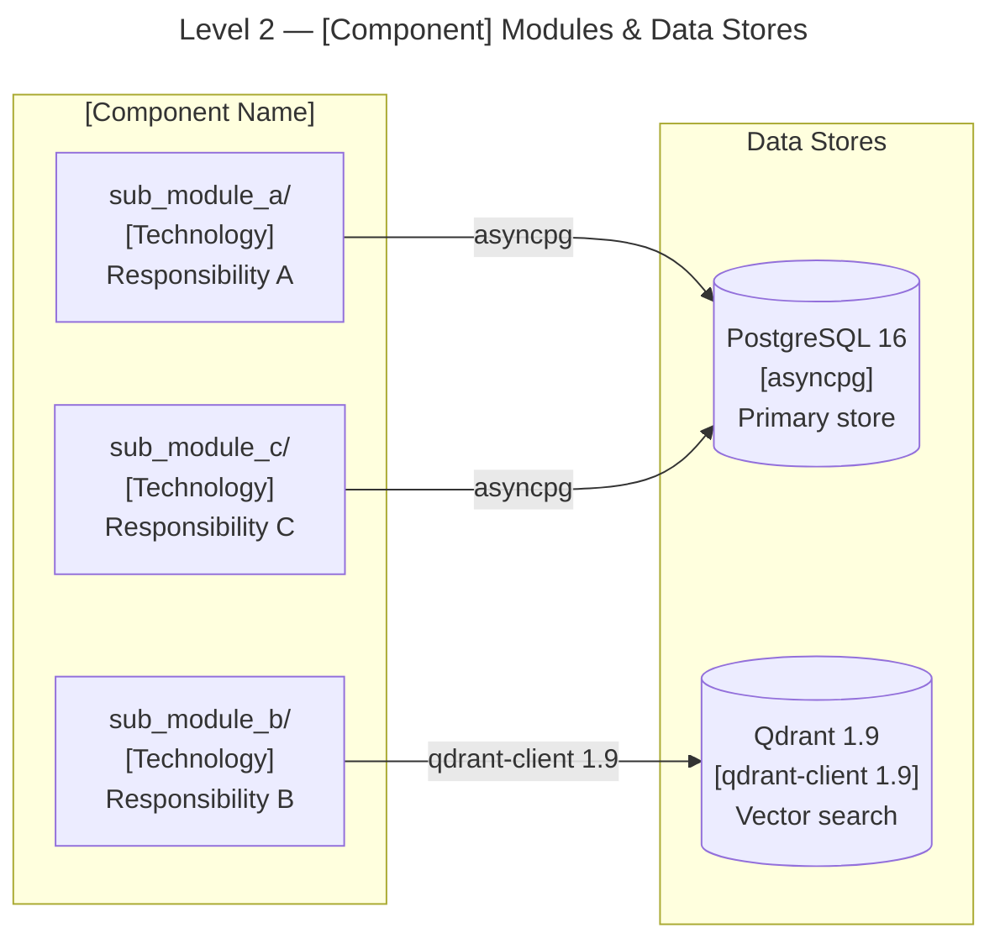
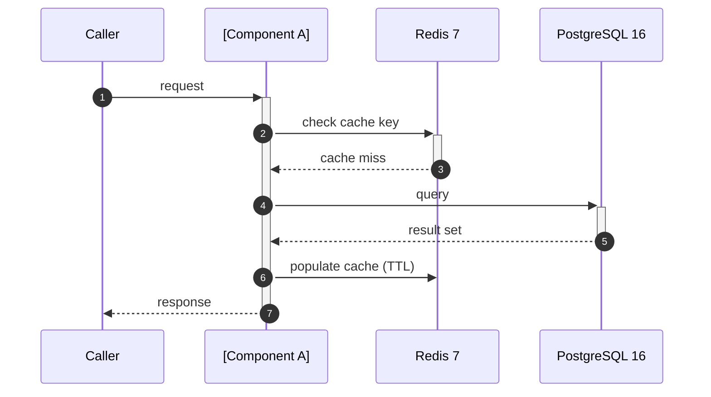

# Architecture: [Component/Module Name]

> **Version**: {version} · **Status**: {status} · **Component**: `{component}/`

---

## Executive Summary

**Purpose:** <!-- 1-2 sentences: what this component does and why it exists in the skill -->

**Scope:**
- **In scope**: <!-- what this document covers -->
- **Out of scope**: <!-- explicit exclusions -->

**Key Decisions:**
- <!-- Decision 1 → [ADR-NNN](../../adr/adr_NNN_name.md) -->
- <!-- Decision 2 → [ADR-NNN](../../adr/adr_NNN_name.md) -->

---

## Context & Problem Statement

<!-- Why does this component/module exist? What problem does it solve within the skill? -->

**Constraints:**
- **Technical**: <!-- language versions, framework limits — see rule_standards_versions.md -->
- **Security**: <!-- OWASP rules, zero-trust boundaries — see rule_owasp_llm_top10.md -->
- **Performance**: <!-- SLA targets, token budgets, API rate limits, context window -->
- **Integration**: <!-- MCP server dependencies, n8n pipeline requirements -->

---

## Architecture Overview

### C4 Level 1 — System Context

> `flowchart LR` · C4 naming (`[Technology]` on second line) · external systems use `classDef external`
> Diagram rules: `standards/rule_diagram_standards_c4.md`

### C4 Level 2 — Module Structure

> `flowchart LR` · `subgraph` names end in `_b` · database nodes use `[("...")]` cylinder shape
> Diagram rules: `standards/rule_diagram_standards_c4.md`

---

## Component Details

### [Component A Name]

**Purpose:** <!-- what this component does -->

**Technology Stack:**

| Layer | Technology | Version | Notes |
|---|---|---|---|
| Language | Python | 3.12 | see `rule_standards_versions.md` |
| Framework | <!-- --> | <!-- --> | <!-- --> |
| Runtime | Docker | <!-- --> | <!-- --> |

**Key Dependencies** (pin versions per `rule_standards_versions.md`):
- <!-- library==version — purpose -->

**MCP Servers used:**
- <!-- `mcp_server_name` — tool(s) used — approval required? -->

**Responsibilities:**
-

**API / Interfaces:**

| Endpoint | Method | Auth | Description |
|---|---|---|---|
| `/api/v1/{resource}` | GET | JWT RS256 | <!-- --> |
| `/api/v1/{resource}` | POST | JWT RS256 | <!-- --> |

**Events Published / Consumed:**
- **Publishes**: <!-- topic/event · payload schema -->
- **Consumes**: <!-- topic/event · handler function -->

---

## Data Architecture

### Data Flow

> `sequenceDiagram` · autonumber · diagram rules: `standards/rule_diagram_standards_sequence.md`

### Data Storage Strategy

| Store | Type | Technology | Purpose | Backup |
|---|---|---|---|---|
| Primary | Relational | PostgreSQL 16 | <!-- --> | Daily `pg_dump` via n8n |
| Vector | Document | Qdrant 1.9 | <!-- --> | `librarian_sync` pipeline |
| Cache | Key-value | Redis 7 | <!-- --> | Ephemeral — no backup |
| Object | S3-compat | Garage 0.9 + Fernet | <!-- --> | Replicated |

### Data Retention

| Data Type | Retention | Archival Strategy |
|---|---|---|
| <!-- --> | <!-- --> | <!-- --> |

---

## Security Architecture

> References: `references/security/rule_owasp_llm_top10.md` · `references/security/rule_security_toolchain.md`

**Authentication:**
- <!-- Primary: e.g., JWT RS256 signed by web/ module -->
- <!-- MFA policy if user-facing -->

**Authorization:**
- **Model**: <!-- RBAC / scope-based -->
- **Roles / Scopes**: <!-- list with permissions -->

**Secrets Management:**
- All credentials via environment variables (gitignored) — format: `${ENV_VAR_NAME}`
- Sensitive fields in storage/ module encrypted with Fernet before persistence
- Never log tokens, API keys, or PII at any structlog level (C-09)

**OWASP LLM Top 10 Mapping** *(fill for AI/LLM components; omit for non-AI)*:

| Risk | Top 10 Item | Mitigation Applied |
|---|---|---|
| Prompt injection | LLM01 | <!-- --> |
| Insecure output handling | LLM02 | <!-- --> |
| Supply chain | LLM05 | <!-- `safety` CVE scan at VALIDATE → C-14 --> |

**Security Scan Gates (C-14):**
- `bandit` + `safety` + `semgrep` run at every VALIDATE phase
- CRITICAL/HIGH findings → `IssueRecord` + block git gate

---

## Scalability & Performance

**Performance Targets:**

| Metric | Target | Threshold | Action if exceeded |
|---|---|---|---|
| Response latency | <!-- --> | <!-- --> | <!-- --> |
| Throughput | <!-- --> | <!-- --> | <!-- --> |
| LLM confidence | ≥ 0.9 | < 0.7 | RAG tier fallback (C-16) |
| Context budget remaining | > 10 000 tokens | ≤ 10 000 | Defer non-critical L3 loads · emit WARNING (C-17) |

**Bottlenecks identified:**
-

**Scaling approach:**
-

---

## Reliability & Availability

| Component | HA Strategy | RTO |
|---|---|---|
| LangGraph graph | `PostgresSaver` — auto-resume after restart | < 30 s |
| <!-- --> | <!-- --> | <!-- --> |

**Single Points of Failure:**
-

**Backup & Recovery:**
- **Frequency**: <!-- -->
- **RTO**: <!-- --> · **RPO**: <!-- -->
- **Procedure**: <!-- Redeploy via docker compose · restore from pg_dump · re-trigger n8n indexing -->

---

## Monitoring & Observability

> OTel spans + structlog per C-09 · LangFuse wraps every LLM call

**Key Metrics:**

| Metric | Source | Alert Threshold |
|---|---|---|
| <!-- --> | OTel / Prometheus Node Exporter | <!-- --> |

**structlog Events emitted by this component:**

| Event | Level | Required Fields |
|---|---|---|
| `state_transition` | DEBUG | `from_state · to_state · task_id` |
| `interrupt_before` | INFO | `gate · task_id` |
| `rag_fallback` | WARNING | `tier · reason · task_id` |
| <!-- component-specific --> | <!-- --> | <!-- --> |

**LangFuse Observations** *(AI components only)*:
- <!-- observation name → metadata fields tracked (including `confidence_tier`) -->

---

## Risks & Mitigations

| Risk | Likelihood | Impact | Mitigation | Issue Ref |
|---|---|---|---|---|
| <!-- --> | Low/Med/High | Low/Med/High | <!-- --> | <!-- [ISSUE-NNNN](../../issues/{app}/ISSUE-NNNN-slug.md) --> |

---

## Future Enhancements

### Short-Term
- [ ] <!-- Item → [plan ref](../../plans/plan_NNN.md) -->

### Long-Term
- [ ]

---

## Related Documentation

| Document | Type | Relationship |
|---|---|---|
| [ADR-NNN](../../adr/adr_NNN_name.md) | ADR | <!-- decision this doc elaborates --> |
| [rule_NNN](../../standards/rule_NNN.md) | Standard | <!-- standard this component implements --> |
| [ISSUE-NNNN](../../issues/{app}/ISSUE-NNNN-slug.md) | Issue | <!-- known issue affecting this component --> |

---

## Appendices

### Appendix A: Glossary

| Term | Definition |
|---|---|
| RTO | Recovery Time Objective — maximum acceptable downtime |
| RPO | Recovery Point Objective — maximum acceptable data loss |
| OTel | OpenTelemetry — distributed tracing + metrics SDK |
| RAG | Retrieval-Augmented Generation |

### Appendix B: Decision Log

| Date | Decision | Rationale | ADR |
|---|---|---|---|
| <!-- YYYY-MM-DD --> | <!-- decision --> | <!-- why --> | <!-- ADR-NNN --> |

---

## Document Metadata

| Version | Date | Task | Changes |
|---|---|---|---|
| 1.0 | <!-- YYYY-MM-DD --> | <!-- task_id --> | Initial version |

**Next Review**: <!-- YYYY-MM-DD (quarterly recommended) -->
